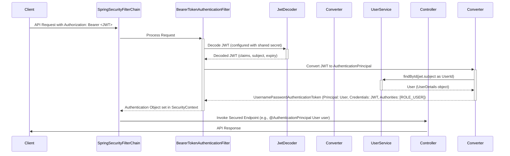
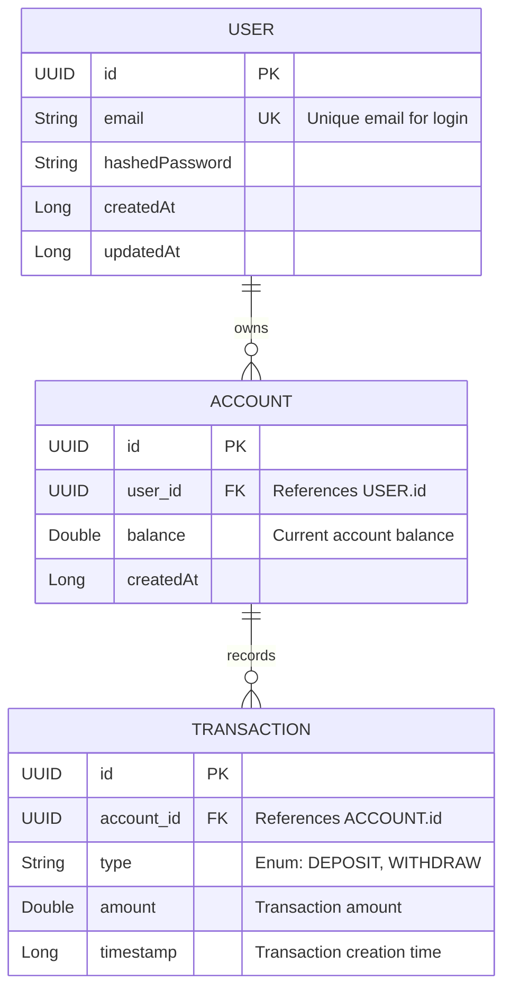

## How to run the app:
### There are two ways to run the app:
#### Option 1 (create a database and run both the server and database)
1. Clone the repo
2. Run
```shell
docker compose up -d
```
#### Option 2 (without docker compose)
1. Clone the app
2. Update datasource uri host, and credentials in `application.properties` to point your database instance
---
## 1. Project Overview

This document outlines the technical plan and current implementation status of the Axis Pay Core Banking System. The system provides fundamental fintech functionalities, enabling users to manage accounts and perform financial transactions. The initial phase focused on delivering core features: user authentication, account opening, deposits, withdrawals, and balance inquiries, adhering to the requirements.

## 2. Goals

The primary goals for the implemented phase were:
* Implement secure user registration and login functionality.
* Allow authenticated users to open new banking accounts.
* Enable users to deposit funds into their accounts.
* Enable users to withdraw funds from their accounts, ensuring sufficient balance.
* Allow users to check their current account balance.
* Ensure all operations are performed securely and transactions are accurately recorded.
* Provide comprehensive API documentation.
* Achieve high test coverage for reliability.

## 3. Current Architecture

### 3.1. High-Level Components

The system is a monolithic Spring Boot application with a PostgreSQL database backend.


### 3.2. Key Technologies

* **Backend Framework:** Spring Boot 3.x
* **Language:** Kotlin 1.9.x
* **Database:** PostgreSQL (for production), H2 (for testing)
* **Persistence:** Spring Data JPA (Hibernate)
* **Security:** Spring Security (JWT-based authentication)
* **API Documentation:** Springdoc OpenAPI (Swagger UI)
* **Testing:** JUnit 5, MockK, RestAssured
* **Build Tool:** Gradle

## 4. Implemented Features

The following core functionalities have been implemented and tested:

* **User Management:**
    * `POST /auth/signup`: Allows new users to register. Passwords are securely hashed using BCrypt.
    * `POST /auth/login`: Authenticates existing users and returns a JWT access token.
* **Account Management (requires JWT authentication):**
    * `POST /api/accounts/open`: Creates a new bank account for the authenticated user. Returns the new `accountId`.
    * `POST /api/accounts/{accountId}/deposit`: Deposits a specified amount into the user's account. Validates positive amount and account ownership. Returns transaction details including the new balance.
    * `POST /api/accounts/{accountId}/withdraw`: Withdraws a specified amount from the user's account. Validates positive amount, account ownership, and sufficient funds. Returns transaction details including the new balance.
    * `GET /api/accounts/{accountId}/balance`: Retrieves the current balance for a specified account owned by the authenticated user.

## 5. API Design

* The system exposes RESTful APIs for all functionalities.
* Input validation is performed at the DTO level using `jakarta.validation` annotations and also within the service layer for business rule enforcement.
* API documentation is automatically generated and available via Swagger UI at `/swagger-ui.html`.
* Standard HTTP status codes are used to indicate success, failure, and errors (e.g., 200 OK, 201 Created, 400 Bad Request, 401 Unauthorized, 403 Forbidden, 404 Not Found, 409 Conflict).

## 6. Security Implementation

Security is a critical aspect of the system:

* **Authentication:** JWT-based token authentication is implemented. The `/auth/login` endpoint issues JWTs upon successful credential validation.
* **Authorization:** API endpoints under `/api/**` require a valid JWT. Account-specific operations verify that the authenticated user owns the target account.
* **Password Management:** User passwords are salted and hashed using BCrypt via `PasswordEncoder`.
* **Transport Security:** Assumed to be handled by a reverse proxy/load balancer (e.g., HTTPS termination) in a production environment.
* **CSRF Protection:** Disabled as the application is stateless and uses JWTs.

### Spring Boot Security Flow (JWT Authentication):



## 7. Data Model

The core entities are `User`, `Account`, and `Transaction`.



* **User:** Stores user credentials and profile information.
* **Account:** Represents a bank account, linked to a User, and holds the current balance.
* **Transaction:** Records all deposits and withdrawals associated with an Account.

## 8. Testing Strategy

The project emphasizes a strong testing culture:

* **Unit Tests:** Service layer logic is unit-tested using MockK to mock dependencies (repositories). Focus is on business rules and edge cases.
    * `AccountServiceTest`
    * `UserServiceTest`
* **Integration Tests:** Controller endpoints are tested using RestAssured and `@SpringBootTest` with an H2 in-memory database. These tests cover the full request-response cycle, including authentication, validation, and data persistence.
    * `AuthControllerIntegrationTest`
    * `AccountControllerIntegrationTest`
* The user reported 100% test coverage for the implemented functionalities.

## 9. Future Improvements

While the current implementation meets the core requirements, the following areas are identified for future enhancements to build a more robust, scalable, and production-ready system:

1.  **Enhanced Error Handling & Response Standardization:**
    * **Details:** Implement a global exception handler using `@ControllerAdvice`. Standardize error responses across all APIs, potentially conforming to RFC 7807 (Problem Details for HTTP APIs). This provides clients with consistent and machine-readable error information, improving integration and debugging.
    * **Benefit:** Improved developer experience for API consumers and more predictable error handling.

2.  **Optimistic Locking for Concurrency Control in Account Balances:**
    * **Details:** Introduce a version field (e.g., `@Version private Long version;`) in the `Account` entity. JPA will use this for optimistic locking. When updating the balance, if the version has changed since the entity was read, an `OptimisticLockException` will be thrown, preventing lost updates in high-concurrency scenarios (e.g., simultaneous deposits/withdrawals to the same account). Retry mechanisms can then be implemented.
    * **Benefit:** Ensures data integrity for critical financial data under concurrent access, preventing race conditions on balance updates. 

3. **Implement Serializable Transaction Isolation Level for High-Contention Scenarios:**
   * **Details:** For critical operations on the same account experiencing high concurrent traffic (e.g., simultaneous deposits and withdrawals), evaluate and implement the SERIALIZABLE transaction isolation level to ensures that concurrent transactions execute as if they were processed one after another, in some serial order.
   * **Benefit:** Provides the highest level of data consistency by eliminating all common concurrency anomalies (dirty reads, non-repeatable reads, phantom reads). This is paramount for maintaining absolute financial integrity under heavy load on specific accounts, though it may come with a performance cost.

4. **API Idempotency for Financial Operations:**
    * **Details:** For critical mutating operations like `POST /api/accounts/{accountId}/deposit` and `POST /api/accounts/{accountId}/withdraw`, implement idempotency by allowing clients to send an `Idempotency-Key` in the request header.
    * **Benefit:** Prevents accidental duplicate transactions due to client retries or network issues, crucial for financial system reliability.

5.  **Database Schema Migrations:**
    * **Details:** Integrate a dedicated database migration tool like Flyway or Liquibase to manage schema evolution in a structured, auditable, and reliable manner across different environments.
    * **Benefit:** Enables safe and repeatable database schema changes, essential for CI/CD pipelines and collaborative development in production environments.

6. **Comprehensive Logging & Observability:**
    * **Details:** Implement structured logging (e.g., JSON format with SLF4J and Logback/Log4j2), including contextual information like trace IDs and user IDs.
    * **Benefit:** Facilitates easier debugging and proactive issue detection.
     
## 10. Challenges & Learnings
* **Data Consistency:** Ensuring that account balances are always accurate, especially with concurrent operations (partially addressed by `@Transactional`, with optimistic locking as a future improvement).
* **Security:** Protecting user data and financial transactions is paramount. This involves secure authentication, authorization, and data handling.
* **Atomicity of Operations:** Financial transactions (like deposit or withdrawal) must be atomic; they either complete fully or not at all. Spring's `@Transactional` annotation at the service layer helps achieve this.
